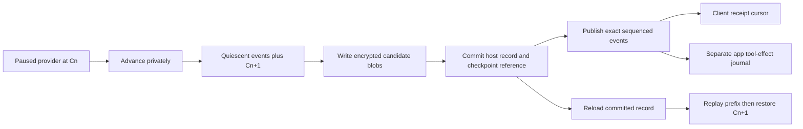

# Generation durability: proposed contract and reference model

**Design proposal, not implemented runtime behavior.** S71 recommends a resumable
provider transaction joined to a durable host publication record. Reach does
not currently restore in-flight generations after daemon death. The companion
[reference probe](../Tools/GenerationDurabilityProbe/README.md) tests synthetic
recovery decisions; it supplies neither model checkpointing nor encryption.

## Decision and boundary

Recommend an explicit opt-in durability mode for **same-host, same-OS-boot,
same-compatible-revision daemon process recovery**, with a surviving client.
Every public event must be committed with a provider checkpoint that accounts
for that event before it can cross the wire. Recovery replays that committed
prefix and continues from its matching checkpoint. It never silently replaces
an observed answer by calling today's `generate` again under the same identity.
Unpublished speculative computation may be repeated from the preceding exact
checkpoint; this is not a promise that every GPU operation executes only once.

This is one all-route contract. Ordinary, guided, allowed-tool and required-tool
MLX routes must each meet it before a provider advertises all-route durability.
The current EXO capability restrictions remain explicit. Missing route support
is `unsupported` before durable admission, not a silent downgrade to volatile
execution, an ordinary-only product claim, or a completed-replay-only substitute.
Durability-off requests retain current behavior. Runtime implementation and the
privacy/wire decisions below need a subsequent approved slice.

The initial scope excludes host power loss/reboot, client process recovery,
cross-host migration, model upgrades, hardware-independent bitwise equality,
pre-login service, universal exactly-once tool effects and a transcript database.
These exclusions make a single-host owner lock and exact compatibility refusal
usable first choices, rather than pretending that opaque execution state can be
migrated. S27's raw-KV, storage and live-crash findings are reused, not rerun.

## What the current sources establish

Source inspection is against Reach `d5eb4b93f22a0b62d7e5a8d8df59550ece8bdaed`
and `mlx-swift-lm` `83f3ef6dc5bc24daeea33cfd9e18ab1383bb0bc8`, the clean local
checkout matching `reachd/Package.resolved`. This is **source-only API
feasibility**, not a compile, model or process-recovery experiment.

- [`SlotFilling`](../reachd/Sources/ReachDaemon/SlotFilling.swift) exposes generate,
  prewarm, capacity and shutdown, but no resumable operation/checkpoint API.
- [`SessionRegistry`](../reachd/Sources/ReachDaemon/SessionRegistry.swift),
  [`ReplayStore`](../reachd/Sources/ReachDaemon/ReplayStore.swift) and
  [`SlotAdmission`](../reachd/Sources/ReachDaemon/SlotAdmission.swift) own volatile
  identity, exact framed replay and reservations. Attachment increments a
  connection epoch; ack/detach/cancel check that epoch. **It is not a durable
  execution-owner fence.** Admission defaults to one active, three waiting,
  one waiter per session and a 120-second wait.
- [`EvAck`](../ReachKit/Sources/ReachWire/Frames.swift) means cumulative receipt.
  [`ReachLanguageModel`](../ReachKit/Sources/ReachKit/ReachLanguageModel.swift)
  drops already-received sequences and can send its batched ack **before**
  forwarding the event into the app channel. Neither receipt nor forwarding
  proves that the adopting app executed a tool.
- In the pinned dependency's `Libraries/MLXLMCommon/Evaluate.swift`, public
  `TokenIterator` has internal pending input `y`, cache, processor and sampler;
  `next()` pipelines evaluation of the next token/cache. A seed constructor
  does not export the current sampler RNG stream position. `LMOutput.State`
  in `LanguageModel.swift` carries a private `[String: Any]` dictionary.
  `ChatSession.saveCache` explicitly saves raw KV, not structured conversation
  or a complete executing generation. Public state threading is useful but is
  not a versioned serializable checkpoint.

## Provider contract and the publication transaction

Introduce a **new adjacent protocol**, without redefining existing `SlotFilling`.
Names below are API sketches, not existing symbols:

```text
assess(binding) -> Ready(checkpointSchema, routes, byteBound) | Unsupported(reason)
prepare(binding, ownerFence) -> paused operation + initial checkpoint C0
advance(operation, ownerFence, priorCommit, eventBudget)
    -> PreparedAdvance(exact events, quiescent checkpoint Cn, terminal?, usage)
acceptCommit(operation, ownerFence, commitID) -> paused/continuable operation
restore(binding, ownerFence, commitID, Cn) -> paused operation | Incompatible(reason)
fenceAndQuery(operationID, newOwnerFence)
    -> exclusive-owned-and-settled | known-terminal | ownership-unknown
cancelAndJoin(operationID, ownerFence) -> settled | ownership-unknown
```

`Ready` is per exact model/route/configuration, with a tested codec for every
state component and a declared maximum checkpoint size. It is not inferred
from raw KV support. `prepare` records a restorable start boundary before
acceptance becomes durable. A failure before that boundary has no accepted
operation. `advance` cannot emit externally or run client tools. It returns only
when GPU work, grammar lookahead and output assembly at that boundary are settled;
no unaccounted token/parser state can still mutate the candidate snapshot.

The host owns a process-lifetime exclusive OS lock and increments a persisted
owner counter on acquisition. The counter, store incarnation and generation
identity form `ownerFence`. A timed-out process does not lose ownership merely
because time elapsed. Local takeover needs release/death of the old process;
remote provider takeover additionally needs an atomic provider-side fence that
all participating workers enforce. A host lock alone cannot fence EXO.



Recommended storage mechanism: immutable versioned checkpoint blobs plus one
atomically replaced generation manifest, serialized under the host owner lock.
Write/flush the candidate blobs and manifest, commit the manifest and sync its
parent before publication; retain the preceding complete set until the new
commit succeeds. Recovery trusts only a complete, authenticated committed
manifest and all its referenced blobs. Orphan candidates are never published.
This is a process-death ordering requirement, not a physical power-loss claim.
A later runtime implementation must prove its actual filesystem primitives.
AEAD does not prove freshness after an offline rollback to older valid store
bytes; that adversarial/snapshot scenario is outside this process-death scope.
A client cursor above the committed high watermark must still refuse, never
license reconstruction of supposedly missing published output.

Each commit binds the provider's operation/checkpoint ID and schema, exact
checkpoint digest, previous commit, next host sequence, exact encoded event
bytes, replay low/high watermarks, cumulative receipt, usage and terminal state.
Large checkpoint/replay bytes live in blobs; the bounded manifest references
them rather than embedding a maximum-size event. An `advance` batch is bounded
by available replay/storage credit. No storage
credit means pause before advancing; if it cannot be made available within the
existing residency/deadline, commit a small explicit failure ending using a
reserved terminal slot. Never publish an event and later fall back to a
checkpoint that forgets it. Never silently discard a required replay span to
keep a durable generation running.

| Death boundary | Recovery ruling |
| --- | --- |
| Before accepted C0 commit | No accepted generation; an explicit new attempt is allowed under bounded create idempotency |
| After C0, before first event | Restore the same paused operation under a new fence; do not invoke ordinary generate as a substitute |
| Candidate Cn+1 incomplete; no events published | Use committed Cn; discard candidate. Unpublished computation can be recomputed from exact state |
| Cn+1 committed, event not sent or receipt lost | Replay exactly the stored event bytes; do not advance the provider to recreate them |
| Visible prefix and later incomplete candidate | Preserve the prefix, restore its matching committed state, continue at the next sequence |
| Terminal committed, before/after terminal receipt | Replay the retained terminal as needed; never acquire a provider lease or start generation again |
| Authoritative manifest corrupt, referenced blob missing, or incompatible revision | Explicit non-resumable failure; no fallback to an older manifest that could erase published events |

A lost `acceptCommit` response is idempotently resolved by `commitID`; it cannot
start another remote operation. For local embedded MLX, a dead process's
uncommitted state is gone. For an external operation, an uncertain fence/query
blocks continuation and new copies until settlement is proven.

## State, owner and API gaps

The request binding includes authenticated device/app identity, durable session,
generation and request IDs, immutable request digest, exact prompt/tokenized
input, route, options/seed, response schema, offered tools and tool mode. Model
weights/configuration, tokenizer/chat template, provider/runtime/backend/device
compatibility IDs and checkpoint schema are exact matches. Hashes identify
bytes; they do not replace the bytes needed for restore or establish trust.

| Execution route | State that must join the checkpoint | Current owner/surface and gap |
| --- | --- | --- |
| MLX ordinary, no schema/tools | KV tensors, offsets/cache type/quantization, pending token, typed model state, current sampler/RNG and penalty history, prepared input, token limit/count, stop state, detokenizer pending bytes/text, usage and queued output | `MLXFilling` delegates to `MLXLMCommon.generate`; iterator/generation loop owns internal state. Some constructors/state access are public; there is no public complete versioned capture/restore plus quiescent publication boundary |
| MLX guided response | All decode state plus schema/compiled-grammar identity, exact accepted grammar tokens, matcher state, pending fast-forward tokens, mask/lookahead boundary, whitespace-run tracker, closing/hard-reserve policy, accumulated text and detokenizer | `MLXGuidedGeneration/GuidedGenerationLoop.swift` owns local cache/model state/logits/loop variables. `GrammarConstraint` exposes mask/commit, rollback and in-process clone, but an opaque matcher clone is not a restartable snapshot. Needs export/restore or exact accepted-token replay without applying fast-forward twice |
| MLX allowed tools | Ordinary proposal-pass state, tool-call parser format/scanner buffers/state, emitted-call set/ordered queue, buffered/private or already-streamed prose, selected proposals and stable IDs, selected route, current replay-pass index/input/grammar, accumulated multipass usage | `MLXFilling` runs a proposal pass then may replay each selected call through guidance or choose prose/schema. `ToolCallProcessor` keeps private parser/buffer/queue state. Needs both dependency codecs and a Reach-owned route coordinator snapshot across pass boundaries |
| MLX required tools | Guided structural-envelope state, offered/selected names/schema, partial argument buffer, completion policy, stable tool-calls entry ID and call ID, usage/terminal state | `MLXFilling.runToolGuidance` buffers output, validates the envelope and currently mints a UUID when emitting the call. Allocate/persist IDs before publication and restore them; expose guidance continuation. Never mint a replacement ID for an already committed call |
| EXO HTTP/SSE, current supported prose subset | Immutable operation ID; request/model/backend/rank/topology bindings; server/rank execution and sampling/checkpoint state; provider event cursor; transport-to-host decoder/SSE partial-line/UTF-8/terminal state; ownership/cancel settlement and usage | `EXOFilling` owns a live URL operation, readers, timers and bounded SSE parser, not a durable external execution. Remote process survival alone proves nothing. Requires EXO-owned operation lookup, all-rank checkpoint/fencing/restore and replay, plus a Reach adapter barrier. Schema, offered-tool and tool-bearing-transcript refusals remain; no fictional all-route EXO support |

The host additionally owns sequence assignment, immutable replay, admission,
receipt cursor, authorization/session binding and durable cancellation/terminal
rulings. The client/app owns forwarding, the effect journal and actual tool
result. Neither cache serialization nor an HTTP command identifier combines
these owners into a transaction.

**Smallest next provider dependency:** a bounded `mlx-swift-lm` change owned by
the MLX provider/dependency maintainer: a paused `ResumableTokenDriver` with
versioned capture/restore of the pending token, all cache state, registered typed
`LMOutput.State` codecs, sampler RNG position and processor history, with an
explicit settled-step boundary. Unregistered model state must return unsupported.
Prove same-compatible-revision continuation of that driver before Reach storage
integration. This does not by itself complete durability: generation output/
detokenizer codecs, guided matcher/loop state and Reach's allowed/required route
coordinator snapshots are named remaining dependencies. EXO's owner must supply
its separate remote operation/fence/checkpoint protocol. No such work is shipped
or authorized by this design; no ordinary-only acceptance is substituted for
all four MLX routes.

## Identity, replay and admission after restart

Persist the immutable binding at acceptance. A repeated begin with identical
binding attaches/replays; changing request, principal, route or revision under
that key refuses. A new answer requires explicit user/app intent and a new
operation identity. Within a proposed durable session, keep a cancellation/
expiry/completion tombstone even after deleting content so a retransmitted begin
cannot recreate the work.

Recommend a separate negotiated durable-session ticket bound to the authenticated
principal and an absolute lifetime of at most 24 hours. The server verifies the
ticket and expiry before create/reattach, using a separate session-token key,
not the CA key. Keep tombstones until ticket expiry; then reject the expired
namespace even if its records have been deleted. A renewed session is a new
namespace, never silent continuation. Cap retained operation/tombstone records
at 64 globally and refuse new durable begins when full. This gives bounded
idempotency without an indefinite history of every generation ID.

After startup, authenticate/validate records before enabling durable admission.
Reconstruct an active record as **recovering**, not an already-running task;
reacquire the single lease only after local old-owner death or an authoritative
remote fence. An uncertain external operation occupies that capacity logically
while blocked, even if no local task exists. Do not race it with a replacement.
At content expiry, delete the content but keep that provider disabled. If its
operation remains unsettled when the session/tombstone expires, discard the
operation's identifiers and retain only one bounded provider-wide disabled
flag/owner epoch. Re-enabling requires an authoritative global fence/settlement
for that provider (or explicit operator removal), never elapsed time alone.
This availability cost keeps retention finite without guessing that old work
stopped. The flag contains no generation, request or tool content.
A valid queued record has no provider checkpoint/work yet: reconstruct eligibility
with its original expiry and the one-waiter-per-session rule. Select among
eligible waiters after active recovery; **durable FIFO is not promised**.
Duplicate begins/recovery must not create a second reservation. Completed,
cancelled and expired records need no execution lease.

Keep the existing 120-second wait and detached-residency bounds; persist their
same-boot deadlines rather than refreshing them on restart. The proposal adds
an absolute 15-minute in-flight recovery/content lifetime. A restart after any
applicable deadline gets an explicit expired/lost outcome. Changed clock/boot,
model/tokenizer/provider revision, schema, principal authorization or codec
compatibility refuses; no migration, silent reset or lease reconstruction by
counting old process IDs.

Replay is at least once over the network. For a surviving client, its retained
sequence cursor suppresses duplicate visible events and rejects gaps or changed
bytes. Receipt may advance before app forwarding today, so current `EvAck` is
not a durable app commit. The future opt-in protocol needs a distinct durable
receipt/terminal-receipt from a capable client adapter after its chosen stable
handoff boundary. Old clients cannot accidentally negotiate these semantics.
If that client's cursor/journal is unavailable, report uncertainty instead of
claiming invisible recovery; app-process recovery is outside this first promise.

## Client-owned effects and acknowledgements

A tool-call event contains a stable generation-scoped call ID and argument
digest, committed with the provider/host state before publication. Tool effects
still happen in the adopting app, often after the generation's complete terminal
and before a subsequent request carrying the result. A model terminal is not a
tool-completion acknowledgement, and the proposal must not merge those lifetimes.

| Call knowledge | Required action |
| --- | --- |
| Not yet committed/published | No app effect is possible from this candidate; discard/recompute only unpublished work |
| Committed but delivery not confirmed | Replay the same call ID/arguments. Do not assume that a lost receipt means the app did nothing |
| App has recorded delivery/intent; outcome unknown | Report unknown. Never auto-invoke the call again, infer success from EvAck, or invent a result |
| App has durably recorded result/failure under that ID and argument digest | Return the same known result; reject an ID reused with different arguments |

Recommend an opt-in client effect adapter with `BeginEffect(callID,argsDigest)`
recorded before invocation and `RecordOutcome(callID,resultDigest,result)` after.
A negotiated `ToolOutcome` report carries that durable knowledge separately
from event receipt. A terminal durable receipt requires stable handoff of every
pending call ID and argument to the client adapter, not just receipt of bytes.
If the target tool honors the same idempotency key or offers
an authoritative outcome query, the app may reconcile through that documented
interface. Otherwise the user/app must choose an explicit safe resolution:
record a verified result, abandon the unknown call, or intentionally make a new
call that may repeat the effect. The daemon may not make that choice. There is
always a possible crash between an external effect and recording its outcome;
no universal exactly-once effect guarantee is proposed.

The client adapter must retain its own minimal outcome/tombstone record for the
durable-session lifetime. A host cancellation or host-data deletion does not
undo an effect or erase the app's obligation to preserve an unknown outcome.
The reference counter deliberately exposes this gap: its effect can be 1 while
its recorded result is unknown; replay then refuses to increment it again.

## Opt-in content at rest: concrete proposed policy

Default remains off. A future runtime opt-in must explain that prompts/prepared
input, output/replay, schema/tool definitions, tool arguments/results provided
in requests, intermediate parser text, checkpoint tensors/state and usage can
be retained. Treat tensors and state as sensitive content, not harmless cache.
Do not log plaintext, keys, prompt hashes usable as public identifiers or tool
payloads. Log only bounded status/error categories.

Proposed owner is the existing daemon service principal, with a canonical private
0700 store and regular 0600 files, no shared cache/backup/sync location. Revalidate
the client's current authenticated authorization on recovery; the durable ticket
does not replace TLS/device/app authorization. Store no client/CA private keys.

Use platform/library **AES-256-GCM** with independent random per-generation data
keys, fresh 96-bit nonces and authenticated associated data covering format,
store/session/generation identity, owner/commit number, blob role and compatibility
digest. Use a separate OS-protected wrapping key, not any CA/signing key; wrap
per-generation keys and separate bounded session-token/metadata keys through the platform's
standard key APIs. Encrypt tombstones under the session metadata key so deletion
of a generation's content key does not discard its no-reexecution ruling.
A future macOS implementation may use a new dedicated
Keychain item under explicit opt-in; Linux needs an explicitly configured
OS-protected secret provider. No custom encryption, key file next to ciphertext,
implicit passwordless fallback or reuse of test TLS keys. This is a proposal;
S71 neither accesses Keychain nor creates keys.

| Proposed finite limit | Consequence |
| --- | --- |
| Four live generations (one active + three waiting), 64 total records/tombstones plus one fixed disabled-provider flag | Refuse new durable admission before starting work when full |
| Request/manifest each at most 1 MiB; checkpoint at most 128 MiB | Provider readiness must prove its bound; refuse unsupported request/model size before durable start |
| At most one committed plus one prepared checkpoint; replay window at most 16 MiB + 4 bytes per generation | Budget old/new copies and candidate output before advancement; preserve exact whole events and reserve a small terminal record |
| 512 MiB per live generation, 2 GiB entire store including scratch/ciphertext overhead | Account actual stored bytes, not tensor estimates; no unbounded orphan or replay accumulation |
| Existing wait/detached deadlines plus absolute in-flight lifetime 15 minutes | Expire without refreshing on restart; delete execution/content state and retain only a tombstone |
| Complete terminal receipt or at most 10 minutes after terminal commit, whichever first | Delete host request/checkpoint/replay content; keep the encrypted minimal identity/ending tombstone until session expiry |
| Cancellation | Fence/cancel/join first, persist the cancellation ruling, then delete execution/content state; unknown remote ownership remains blocked until settled, with content expiry still enforced |
| Session/tombstone lifetime at most 24 hours | Delete tombstone and per-generation wrapped key; reject expired ticket namespace. Bound orphan cleanup by the same store quota |

Large models/requests that cannot fit must receive an explicit unsupported
outcome; these candidate limits are not a claim that every current model fits.
A committed blob with failed AEAD authentication, missing data or schema mismatch
is quarantined from execution and publication, then deleted under the same finite
expiry/admin-removal policy. An incomplete uncommitted candidate is disposable
only after proving it is unreferenced. Do not downgrade to an older visible
history. Expiry/cancellation erase wrapped generation keys and unlink owned
ciphertext as policy dictates, without claiming physical secure erasure from
SSD snapshots/backups. Account for key copies already held in memory.

When the wrapping/session key is locked, logged out or unavailable, report
`recovery-key-unavailable` and start no durable operation. Recover after the key
returns only if compatibility and deadlines still hold. Do not create a new key
and reinterpret old records, silently store plaintext, or promise pre-login
operation. Key rotation is explicit; old wrapped material remains readable only
for its finite retention window. New runtime work must approve the secret-store,
backup exclusion, consent UI, cancellation/expiry behavior, negotiated durable
receipt/tool-outcome/ticket semantics and provider capability rollout. Those
are proposed future policies, not effective changes to current Reach.

## What the probe establishes, and what it does not

**Synthetic-model behavior:** a small standard-library Python provider whose
entire checkpoint is a next-integer cursor. An atomic local image combines that
cursor and sequenced integer/call/terminal events. Deterministic owned subprocess
exits cover an incomplete candidate, a committed unpublished event and a
published event, both before first output and after a visible prefix. Other
checks cover lost receipt/dedup, terminal replay, an exclusive owner and stale
fence, one-active/three-waiting reconstruction, an uncertain external owner,
unknown versus known fake tool results, mismatch, corrupt/expired records,
cancellation and cleanup.

The model blocks retirement/reuse of an unsettled provider slot; it does not
implement the proposed eventual provider-wide disabled flag, separate wait/
detached deadlines or cryptographic content-expiry mechanism. The model
deliberately retains bounded synthetic replay rather than implementing
production pruning; a surviving client holds its visible cursor. Cancellation/
expiry reduce the fake record to a tombstone with an explicit status. The fake
external-owner settlement input is an assertion to exercise the policy, not
proof of a real remote fence. The independent fake effect counter stands in for
an app-owned action; no adopting app/tool runs. The checksum detects accidental
model-file damage; **it is not authenticated encryption or tamper resistance**.
The probe omits real token/model/grammar state, keys, wire negotiation, durable
client handoff, large-checkpoint performance and platform secret stores.

**Real-provider proof still required:** a real provider must capture every
state component above, restore under the exact compatibility binding, and
produce continuation/replay consistent with the committed visible prefix at
its actual asynchronous boundaries, including all four MLX routes. EXO must
also prove distributed settlement/fencing. The proposed storage/key/wire/client
contracts then need actual implementation and bounded process-crash tests.
The design and synthetic checks can be accepted now; runtime durability is not
ready, and no subsequent runtime slice is opened by their acceptance.
